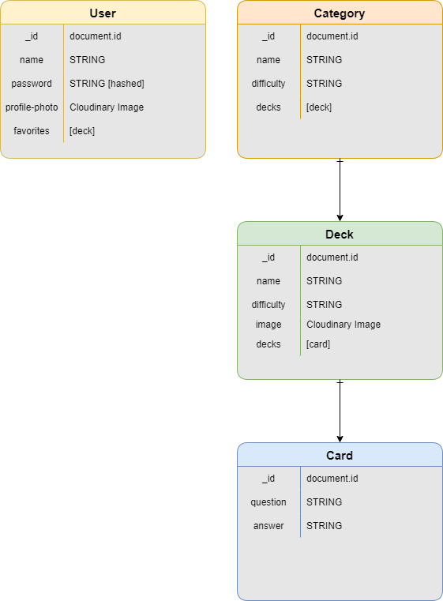

# DevelUp
A fullstack application that allows users to create flash cards and organize them by categories. Inside each category will have a list of decks. For example, inside a Web Developer catergory there might be a deck for React and Node.
Inside each deck will have a series of cards that contain questions of varying difficulties. A user can submit their answers to the questions and then the actual answer will be revealed. A user can utilize the app to see what topics they understand and what topics they need to improve on.
It's time to DevelUp! 

## User Stories
* As an unregistered user, I would like to sign up with name, username, email, and password
* As a registered user, I would like to sign in with email and password
##### As a signed in user: 
* I would like to be able to change my name and or username
* I would like to be able to add a profile picture
* I would like to be able to sign out
* I would like to see a list of card decks to study
* I would like the ability to add certain decks to my favorites
* I would like to have my own profile page which displays my favorite decks
* I would like to remove decks from my favorites list
* I would like to see the cards that are inside the decks
  - see the questions on the cards
  - after submitting see the actual answer

## Installation Instructions
- TBD

## Tech Used
* NodeJS
* Express
* React
* MongoDB
* Bootstrap

## [noSQL] Data Model Diagram

| Method | Path | Purpose |
| ------ | -------------- | -------------------------------- |
| GET | `/` | home page that allows user to sign in or sends user to create an account |
| GET | `/signup` | sign up page to allow user access to the site |
| POST | `/` | user signs in and gets redirected to `GET /category/index`  |
| POST | `/signup` | creates a new user, then redirects back to `GET /` to login |
| POST | `/profile` | updates a new user, then redirects back to `GET /` to login |
| UPDATE | `/user/:id` | updates a new user, then redirects back to `GET /` to login |
| GET | `/category/index` | page that shows all decks in the database |
| GET | `/logout` | allows the user to log out, then redirects back to `GET /` |
| GET | `/category/:id` | page that shows a specific category where users can choose a deck|
| PUT | `/category/:id/post` | user can favorite a deck and the user always stays on `GET /category/:id` |
| DELETE | `/category/:id/` | user can delete a favorite, the user always stays on `GET /category/:id` |
| POST | `/category/:id/post` | creates a deck, the user always stays on `GET /category/:id` |
| PUT | `/category/:id/` | user can update a deck card and the user always stays on `GET /category/:id` |
| DELETE | `/category/:id/` | user can delete all of their Cards, the user always stays on `GET /category/:id` |

**** Stretch Goals ****
| Method | Path | Purpose |
| ------ | -------------- | -------------------------------- |
| GET | `/category/:id/Card/:id` | page that shows a specific category where users can choose a card|
| POST | `/category/:id/Card:id` | creates a card, the user always stays on `GET /category/:id` |
| PUT | `/category/:id/Card` | user can update a card and the user always stays on `GET /category/:id` |
| DELETE | `/category/:id/Card` | user can delete of their cards, the user always stays on `GET /category/:id` |

 # MVPs
- [] Build a frontend client using REACT
- [] Build a Mongodb database of users that can be accessed to create and login users
- [] Users are able to log out from the application
- [] Allow users to have the ability to upload their own profile picture
- [] Have one category with 2 decks for users to study from
- [] Allow users to favorite their deck
- [] Allow users to see all of their favorites 
- [] Allow users to update their profile 
- [] Allow users to delete their favorites 
- [] Allow users to see the cards that are inside the decks
- [] Allow users to type the answers to the questions in the deck of cards

# Stretch Goals
- [] Create multiple categories with at least 2 decks of flash cards
- [] Create an about DevelUp + page 
- [] Allow users to create a deck of flash cards
- [] Allow users to update and/or delete the deck of flash cards they have created
- [] Allow users to favorite deck of flash cards of their liking
- [] Allow users to create categories of the deck of flash cards
- [] Allow users to choose pre-sets of the difficulty level (Easy, Medium, Hard)
